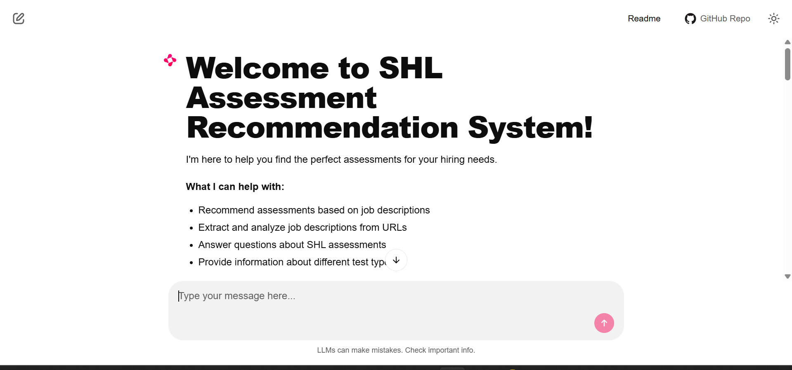
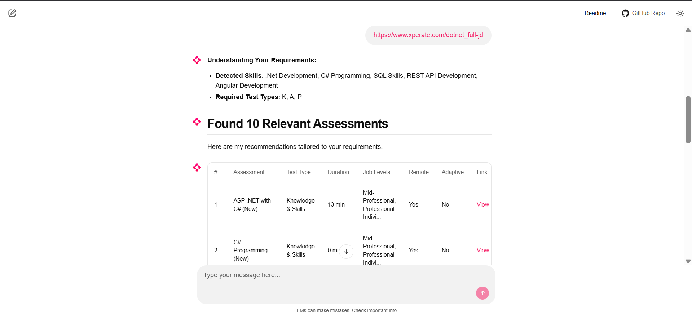
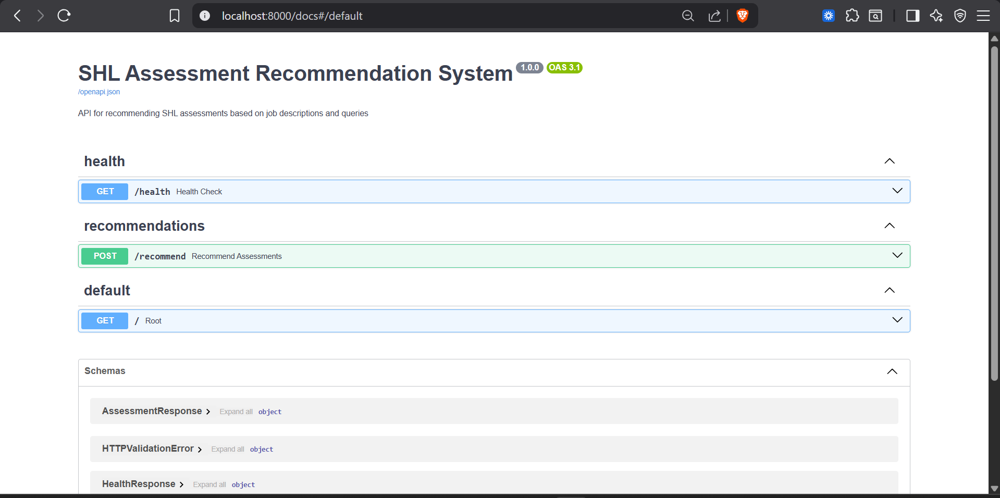
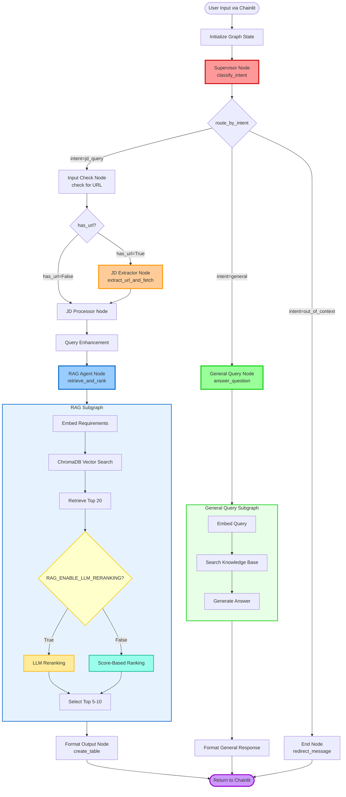

# SHL Assessment Recommendation System

An intelligent AI-powered system for recommending SHL assessments based on job descriptions and natural language queries using LangGraph, OpenAI, and RAG architecture.

## Deployment

### FastAPI Backend
The FastAPI backend is deployed and accessible at:
[https://api-shl-79dr.onrender.com/docs](https://api-shl-79dr.onrender.com/docs)


## API Endpoints

| Feature | Endpoint | Method | Description |
|---------|----------|--------|-------------|
| **Health Check** | `/health` | GET | Checks if the API is running and healthy. |
| **Recommendations** | `/recommend` | POST | Generates SHL assessment recommendations based on input. |
| **Root** | `/` | GET | Root endpoint providing API information. |

---

### Chainlit Frontend 
The Chainlit frontend interface is deployed at:
[https://assessment-recommendation-aupy.onrender.com](https://assessment-recommendation-aupy.onrender.com/)

## Frontend Screenshots:







## FASTAPI Endpoints




---

## Architecture

### LangGraph Workflow

The complete orchestration flow showing how queries are processed through different agents and decision points:




---

## System Components

### Agents

The system uses 5 specialized AI agents orchestrated by LangGraph:

#### 1. **Supervisor Agent** (`app/agents/supervisor_agent.py`)
**Purpose:** Classifies user intent to route queries appropriately

**Key Functions:**
- Intent classification (jd_query, general, out_of_context)
- Confidence scoring
- Fallback keyword matching
- Query validation

**Technology:** 
- Open AI LLM with structured output
- Pydantic schema validation
- Pattern matching fallback

**Input:** Raw user query
**Output:** Intent classification with confidence score

---

#### 2. **JD Extractor Agent** (`app/agents/jd_extractor_agent.py`)
**Purpose:** Extracts URLs and fetches job descriptions from web pages

**Key Functions:**
- URL detection (regex + LLM)
- Web page fetching
- HTML parsing
- Job description extraction

**Technology:**
- BeautifulSoup4 for HTML parsing


**Input:** Query with potential URL
**Output:** Extracted job description text

---

#### 3. **JD Processor Agent** (`app/agents/jd_processor_agent.py`)
**Purpose:** Analyzes and enhances job descriptions

**Key Functions:**
- Skill extraction (technical & soft)
- Duration constraint detection
- Job level identification
- Test type inference
- Key requirement extraction

**Technology:**
- Open AI LLM for deep analysis
- Rule-based extraction as fallback
- Pydantic EnhancedQuery schema

**Input:** Job description or query text
**Output:** Structured requirements (EnhancedQuery)

---

#### 4. **RAG Agent** (`app/agents/rag_agent.py`)
**Purpose:** Retrieves and ranks relevant assessments using RAG

**Key Functions:**
- Vector similarity search
- LLM-based reranking
- Duration filtering
- Top-K selection (5-10 assessments)

**Technology:**
- ChromaDB vector search
- Open AI embeddings
- LLM reranking

**Input:** Enhanced query with requirements
**Output:** 5-10 ranked assessments

---

#### 5. **General Query Agent** (`app/agents/general_query_agent.py`)
**Purpose:** Handles questions about assessments and the system

**Key Functions:**
- Answer FAQ questions
- Provide assessment details
- Explain system functionality
- Search knowledge base

**Technology:**
- Open AI LLM for generation
- ChromaDB for context retrieval
- Pre-defined FAQ responses

**Input:** General question
**Output:** Informative answer with optional related assessments

---

### Services

#### **LLM Service** (`app/services/llm_service.py`)
- Open AI API integration
- Structured output generation

#### **Embedding Service** (`app/services/embedding_service.py`)
- Generate embeddings using Open AI
- Batch processing
- Similarity computation

#### **Vector Store Service** (`app/services/vector_store_service.py`)
- ChromaDB operations
- Assessment indexing
- Vector search
- Collection management

#### **Scraper Service** (`app/services/scraper_service.py`)
- Web scraping SHL catalog
- Pagination handling
- Data extraction
- JSON storage

#### **Session Service** (`app/services/session_service.py`)
- Session management
- Interaction tracking
- Statistics calculation
- Database persistence

---

##  API Endpoints

### Core Endpoints

#### `POST /recommend`
**Purpose:** Get assessment recommendations for a job description

**Request:**
```json
{
  "query": "I need assessments for Python developers who can collaborate with teams"
}
```

**Response:**
```json
{
  "recommended_assessments": [
    {
      "adaptive_support": "No",
      "description": "Multi-choice test that measures the knowledge of Python programming...",
      "duration": 11,
      "name": "Python Programming Test",
      "remote_support": "Yes",
      "test_type": [
        "Knowledge & Skills"
      ],
      "url": "https://www.shl.com/products/product-catalog/view/python-new/"
    }
  ]
}
```

**Features:**
- 5-10 assessments returned
- Balanced test type distribution
- Respects duration constraints
- Ranked by score and llm ranking

---

#### `GET /health`
**Purpose:** Health check endpoint

**Response:**
```json
{
  "status": "healthy"
}
```

**Checks:**
- Database connectivity
- ChromaDB status
- LLM service availability

---

## Project Structure

```
Assessment_Recommendation/
│
├── .env                              # Environment configuration
├── .chainlit                         # Chainlit configuration
├── chainlit.md                       # Chainlit welcome page
├── requirements.txt                 
├── README.md                         
├── run.py                            # FastAPI runner
├── run_chainlit.py                   # Chainlit runner
├── predictions.csv                   # for test-set prediction used /recommend
│
├── app/                              # Main application 
│   ├── __init__.py
│   ├── main.py                       # FastAPI application entry
│   ├── config.py                     # Configuration management
│   │
│   ├── agents/                       # Agents
│   │   ├── __init__.py
│   │   ├── base_agent.py            # Base agent class
│   │   ├── supervisor_agent.py      # Intent classification
│   │   ├── jd_extractor_agent.py    # URL extraction & fetching
│   │   ├── jd_processor_agent.py    # JD parsing & enhancement
│   │   ├── rag_agent.py             # RAG retrieval & ranking
│   │   └── general_query_agent.py   # General questions handler
│   │
│   ├── api/                          # FastAPI routes
│   │   ├── __init__.py
│   │   ├── dependencies.py          
│   │   ├── middleware.py           
│   │   │
│   │   └── routes/                   # API endpoints
│   │       ├── __init__.py
│   │       ├── health.py            # Health check
│   │       ├── recommend.py         # Main recommendations
│   │
│   ├── database/                    
│   │   ├── __init__.py
│   │   ├── sqlite_db.py             # SQLite connection
│   │   ├── chroma_db.py             # ChromaDB connection
│   │   │
│   │   └── migrations/               # Database migrations
│   │       └── init_db.sql
│   │
│   ├── graph/                        # LangGraph 
│   │   ├── __init__.py
│   │   ├── state.py                 # Graph state definitions
│   │   ├── nodes.py                 # Graph node implementations
│   │   ├── edges.py                 # Conditional edge logic
│   │   ├── workflow.py              # Main workflow orchestration
│   │   └── utils.py                 # Graph utilities
│   │
│   ├── models/                      
│   │   ├── __init__.py
│   │   ├── schemas.py               # Pydantic API schemas
│   │   ├── database_models.py       # SQLAlchemy ORM models
│   │   └── assessment.py            # Assessment data models
│   │
│   ├── prompts/                     
│   │   ├── __init__.py
│   │   ├── supervisor_prompts.py    # Supervisor agent prompts
│   │   ├── jd_extraction_prompts.py # JD extraction prompts
│   │   ├── rag_prompts.py           # RAG & reranking prompts
│   │   └── general_query_prompts.py # General query prompts
│   │
│   ├── services/                     
│   │   ├── __init__.py
│   │   ├── llm_service.py           # Gemini LLM integration
│   │   ├── embedding_service.py     # Gemini embeddings
│   │   ├── vector_store_service.py  # ChromaDB operations
│   │   ├── scraper_service.py       # Web scraping
│   │   ├── jd_fetcher_service.py    # JD fetching from URLs
│   │   └── session_service.py       # Session management
│   │
│   └── utils/                        # Utility functions
│       ├── __init__.py
│       ├── logger.py                # Logging configuration
│       ├── validators.py            # Input validation
│       ├── formatters.py            # Output formatting
│       └── helpers.py               # General helpers
│
├── chainlit_app/                     # Chainlit frontend
│   ├── __init__.py
│   ├── app.py                        # Main Chainlit application
│   │
│   ├── components/                   # UI components
│   │   ├── __init__.py
│   │   ├── table_renderer.py        # Assessment display
│   │   └── progress_tracker.py      # Progress indicators
│   │
│   ├── handlers/                     # Request handlers
│   │   ├── __init__.py
│   │   ├── message_handler.py       # Message processing
│   │   └── session_handler.py       # Session management
│
├── data/                            
│   ├── shl_assessments.json         # Scraped  377 assessments data
│   ├── labeled_train_set.json       # data
│   └── Test-Set.json                # Test queries
│
├── storage/                          # Database storage
│   ├── sqlite/
│   │   └── sessions.db              # SQLite database
│   │
│   └── chroma/                      # ChromaDB storage
│       └── assessments/             # Vector collections
│
├── scripts/                          
│   ├── __init__.py
│   ├── scrape_catalog.py            #scraper  
    ├── initailize_vector_store.py    
│
└── logs/                             # Application logs
    ├── app.log                       # Main application log
```

### Key Directories Explained

- **`app/agents/`** - Contains all 5 AI agents with their logic
- **`app/api/routes/`** - All FastAPI endpoint implementations
- **`app/graph/`** - LangGraph workflow orchestration
- **`app/prompts/`** - LLM prompts for each agent (fully written, no truncation)
- **`app/services/`** - Business logic and external service integrations
- **`chainlit_app/`** - Complete Chainlit frontend application
- **`scripts/`** - Standalone script for scraping SHL test assesments
- **`data/`** - Assessment data and training sets
- **`storage/`** - Persistent storage for databases

---

## Getting Started

### Prerequisites

- Python 3.11
- Open AI API Key 

### Installation

```bash
# 1. Clone repository
git clone https://github.com/vinu0404/https://github.com/vinu0404/Assessment_Recommendation.git
cd Assessment_Recommendation

# 2. Create virtual environment
python -m venv venv

# 3. Activate virtual environment
# Linux/Mac:
source venv/bin/activate
# Windows:
venv\Scripts\activate

# 4. Install dependencies
pip install -r requirements.txt

# 5. Create .env file and add your Open AI API key
cp .env.example .env
# Edit .env and add your Open AI_API_KEY
```


### Running the Application

**Terminal 1 - FastAPI Backend:**
```bash
python run.py
# Access at: http://localhost:8000
# API Docs: http://localhost:8000/docs
```

**Terminal 2 - Chainlit Frontend:**
```bash
python run_chainlit.py
# Access at: http://localhost:8001
```

---

##  Usage Examples

### Example 1: Job Description Query in Chainlit

**Input:**
```
I'm hiring for a Senior Java Developer who needs to collaborate 
with business teams. Looking for assessments under 60 minutes.
```

**Process:**
1. Supervisor classifies as `jd_query`
2. JD Processor extracts: Java, collaboration, senior level, 60 min
3. RAG retrieves Knowledge & Skills + Personality & Behavior tests
4. Returns balanced 5-10 assessments

**Output:**
- Java Programming Test
- Interpersonal Communication
- Team Collaboration Assessment
- Technical Problem Solving
- [More balanced recommendations...]

### Example 2: URL-Based Query

**Input:**
```
Here's the job posting: https://example.com/jobs/data-scientist
```

**Process:**
1. Supervisor classifies as `jd_query`
2. JD Extractor fetches and parses the URL
3. JD Processor analyzes full job description
4. RAG recommends relevant assessments

### Example 3: General Question in Chainlit only 

**Input:**
```
What is the .net assessment and how long does it take?
```

**Process:**
1. Supervisor classifies as `general`
2. General Query Agent searches knowledge base
3. Returns detailed information about Python assessment

**Output:**
```
The .NET (New) assessment is a multi-choice test that measures 
knowledge of programming, modules and libraries.

Duration: 11 minutes
Test Type: Knowledge & Skills
Remote Support: Yes
Adaptive: No
```


